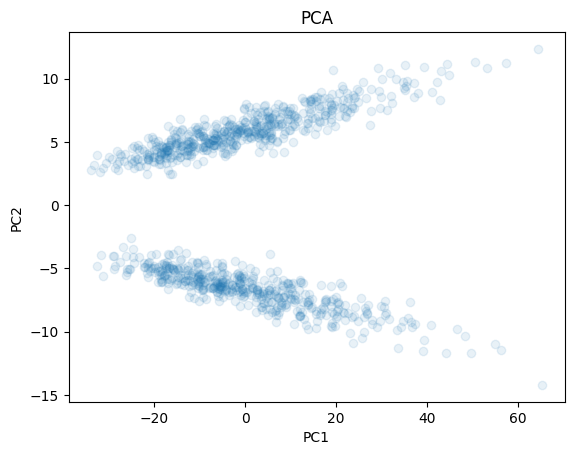
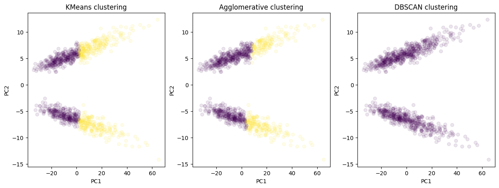
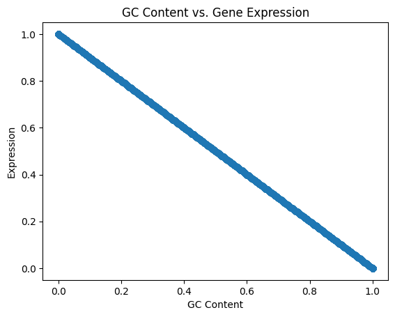
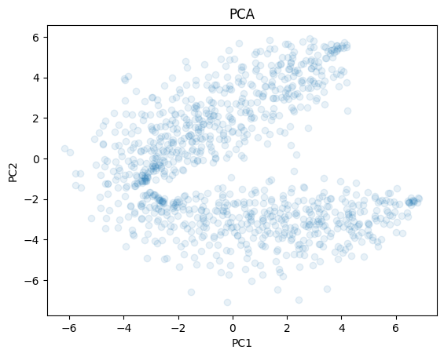
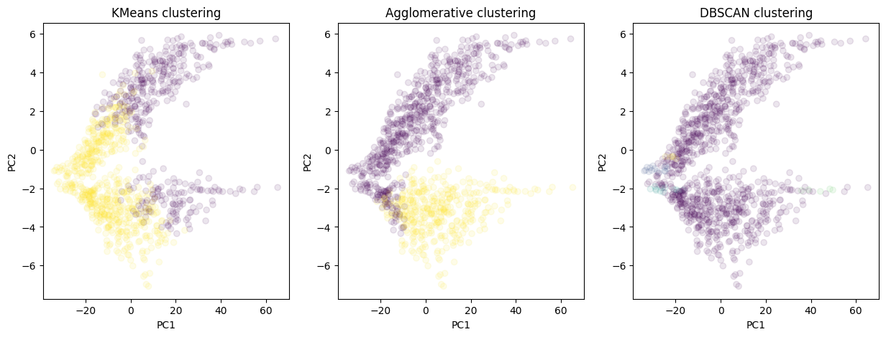

BMEG 424 Assignment 5
================

- [BMEG 424 Assignment 5: Machine Learning for Genome
  Informatics](#bmeg-424-assignment-5-machine-learning-for-genome-informatics)
  - [Introduction:](#introduction)
    - [Goals and Objectives](#goals-and-objectives)
    - [Data](#data)
    - [Software and Tools:](#software-and-tools)
    - [Python on Google Colab:](#python-on-google-colab)
  - [Other notes:](#other-notes)
    - [Submission:](#submission)
  - [Experiment and Analysis:](#experiment-and-analysis)
    - [1. Supervised Learning: Predicting Gene Expression from Promoter
      Sequence (4
      pts)](#1-supervised-learning-predicting-gene-expression-from-promoter-sequence-4-pts)
      - [a. MPRA Data:](#a-mpra-data)
      - [b. Preprocessing:](#b-preprocessing)
      - [c. Training a Simple Neural Network on our
        data](#c-training-a-simple-neural-network-on-our-data)
      - [d. Training a Convolutional Neural Network on our
        data](#d-training-a-convolutional-neural-network-on-our-data)
      - [e. Baseline: Linear Regression](#e-baseline-linear-regression)
    - [2. Unsupervised Learning: Clustering Single-Cell RNA-seq Data (4
      pts)](#2-unsupervised-learning-clustering-single-cell-rna-seq-data-4-pts)
      - [a. RNA-seq Data:](#a-rna-seq-data)
      - [b. Preprocessing/Dimensionality
        Reduction](#b-preprocessingdimensionality-reduction)
      - [d. Clustering (K-means, Hierarchical Clustering,
        DBSCAN)](#d-clustering-k-means-hierarchical-clustering-dbscan)
  - [Discussion (10 pts):](#discussion-10-pts)
- [Contributions](#contributions)

# BMEG 424 Assignment 5: Machine Learning for Genome Informatics

## Introduction:

### Goals and Objectives

The goal of this assignment is to introduce you to various applications
of machine learning in genome informatics. In the first part you will
use two approaches to predict the expression of a gene based on the
sequence of its promoter. In the second part you will use a variety of
unsupervised ML techniques to cluster cells based on their gene
expression profiles.

### Data

The data for this assignment are available on the server at
`/projects/bmeg/A5`: - `MPRA_data.txt` contains the sequences of 10,000
promoters used in an MPRA experiment. The first column contains the
promoter sequence and the second column contains the expression of the
reporter gene - `scRNA_counts.h5` contains the gene expression profiles
of 1500 cells across 2000 genes in a single-cell RNA-seq experiment.
Each row contains the expression profile of a single cell and each
column contains the expression of a single gene.

### Software and Tools:

We will be using a few new tools for this assignment. The reason for
this is that we are aiming to teach you practical skills that are used
in the field. For this reason the majority of our machine learning will
be done using the sci-kit learn, Tensorflow and Keras libraries in
Python instead of in R. In 2024, Python is the language of choice for
machine learning and deep learning. *Do not worry if you are not
familiar with Python. We will provide the majority of the code necessary
for this assignment. You will be responsible for understanding the code
and modifying it as necessary.*

### Python on Google Colab:

You can use Google Colab to run your Python code. Google Colab is a free
cloud service that allows you to run Python code in a Jupyter notebook.
You can access Google Colab at <https://colab.research.google.com/>. You
can upload your data to Google Colab by clicking on the file icon on the
left hand side of the screen (looks like a folder).

Google colab is based off running code in blocks (kind of like R
Markdown!), if you have trouble you can view a tutorial on how to use
Google Colab here:
<https://colab.research.google.com/notebooks/intro.ipynb> . If you have
any questions about how to use Google Colab you can ask the the TA or
post on Piazza.

When training the models you can use the free T4 GPUs provided by Google
Colab to speed up the process. You can do this by clicking on the
`Runtime` tab at the top of the screen and selecting
`Change runtime type`. You can then select `GPU` from the
`Hardware accelerator` dropdown menu. If you do not do this then your
models will take an unnecessarily long time to train.

Another additional benefit is that you will have all of the necessary
libraries installed on Google colab without having to worry about using
conda to install them yourself.

## Other notes:

- As always you must cite any sources you use in your assignment (class
  slides are exempted). This includes any code you use from
  StackOverflow, ChatGPT, Github, etc. Failure to cite your sources will
  result in (at least) a zero on the assignment.

- When you begin your assignment do not copy the data from
  `/projects/bmeg/A5/` to your home directory. You can use the files in
  the projects folder without modifying them. Remember to output any
  files you create in your home directory *and not in the projects
  directory*. You should gzip files while you are working on the
  assignment and remember to delete files you no long need. If you take
  up too much space in your home directory you will not be able to save
  your work and will prevent others from doing the same.

- **Be clear with your answers and justifications. Do not give
  lengthy/multiple possible answers because you are uncertain of the
  actual answer in an attempt to cover all your bases. This will result
  in 0pts for the question even if the correct answer is buried with a
  bunch of wrong answers.**

### Submission:

Submit your assignment as a knitted RMarkdown document. *Remember to
specify the output as github_document* You will push your knitted
RMarkdown document to your github repository (one for each group).
Double check that all files (including figures) necessary for your
document to render properly are uploaded to your repository. **Note**:
In this assignment we are also asking you to upload your .ipynb file
from Google colab (go to file\>download\>download .ipynb) and push it
along with your RMarkdown document.

You will then submit the link, along with the names and student numbers
of all students who worked on the assignment to the assignment 3 page on
Canvas. Your assignment should be submtited, and your last commit should
be made, before 11:59pm on the day of the deadline. Late assignments
will will be deducted 10% per day late. Assignments will not be accepted
after 3 days past the deadline.

## Experiment and Analysis:

### 1. Supervised Learning: Predicting Gene Expression from Promoter Sequence (4 pts)

#### a. MPRA Data:

In the first part of this assignment you will use two approaches to
predict the expression of a gene based on the sequence of its promoter.
These data are from a massively parallel reporter assay (MPRA)
experiment. You will learn more about MRPA’s next week, for now all you
need to know is that in an MPRA, a library of DNA sequences is cloned
upstream of a reporter gene and the expression of the reporter gene is
measured. The sequences in the library are typically designed to test
the effect of mutations or sequence variation on gene expression. The
data for this part of the assignment are in the file `promoters.txt`.
The first column contains the promoter sequence and the second column
contains the expression of the reporter gene.

Our aim is to predict the expression of the reporter gene based on the
sequence of the promoter using machine learning. We will use two
approaches to do this: a simple approach using linear regression and a
more complex approach using a neural network.

#### b. Preprocessing:

The first step is to preprocess the data. As you know, DNA is encoded in
A’s, T’s, G’s and C’s, and our data are in the form of a string
consisting of these nucleotides. Unfortunately our machine learning
models cannot work with strings, so we need to convert the DNA sequences
into a format that can be used for machine learning. We will use a
technique called one-hot encoding to convert the DNA sequences into a
matrix of 0’s and 1’s. In this matrix each column will represent a
nucleotide (A, T, G, C) and each row will represent a position in the
promoter sequence. The value of each element in the matrix will be 1 if
the nucleotide at that position is the same as the column and 0
otherwise.

Our data is stored in a simple text file, so we will need to write a
some code to process our data. Copy and run this code in Google colab:

``` python
import pandas as pd
from sklearn.preprocessing import LabelBinarizer
from sklearn.model_selection import train_test_split

# read in the MPRA data
data = pd.read_csv("/content/drive/MyDrive/PATH/TO/YOUR/DATA", sep='\t', header=None)
# rename the columns
data.columns = ['sequence', 'expression']
# set up the label binarizer from sklearn
lb = LabelBinarizer()
lb.fit(list('ACGT'))
# function for one hot encoding the data
def one_hot_encode(sequence):
    return lb.transform(list(sequence))
# one hot encode the sequence
data['ohc_sequence'] = data['sequence'].apply(one_hot_encode) # this line is using the pandas apply function to run the one_hot_encode function on each row of the dataframe
# preview result
print("Preprocessed data preview: ")
print(data.head())
```

This will read in the data and one-hot encode the sequences. This code
doesn’t save your one-hot-encoded data as we still have some processing
to do.

\#?# 1. What is the purpose of the `LabelBinarizer` class from the
`sklearn.preprocessing` module? (0.5 pts). Would our model work the same
without such a preprocessing step? (0.5pts)

    The LabelBinarizer class from sklearn's preprocessing module is used to convert categorical text data into a numerical format through one-hot encoding. It transforms DNA sequences into binary matrix representations where each nucleotide is encoded as a binary vector.

    The model would not work the same without this preprocessing step because neural networks and other machine learning algorithms require numerical inputs. DNA sequence strings cannot be directly fed into these models. The one-hot encoding keeps the categorical nature of each nucleotide position without forcing an arbitrary numerical relationship between the different nucleotides.

\#?# 2. What are the dimensions of a single one-hot encoded sequence in
your data? Is this what you expected? Why or why not? (1 pts)

    The dimensions of a single one-hot encoded sequence in our data is (200, 4). This makes sense since each promoter sequence is 200 nucleotides long, as it represents 200 positions in the DNA, while each position can be one of four nucleotides (A, C, G, or T).

Generally in machine learning your data are split into X and y, where X
is the data containing the features you will use to make predictions and
y is the data containing the target you are trying to predict. In this
case, X will be the one-hot encoded matrix and y will be the expression
of the reporter gene. We also need to split the data into a training
set, validation set and test set. The training set is used to fit the
model, the validation set is used to tune the hyperparameters of the
model and the test set is used to evaluate the performance of the model.
We will use the `train_test_split` function from the
`sklearn.model_selection` module to do this. Here is some code to get
you started:

``` python
import numpy as np
from sklearn.model_selection import train_test_split

# split the data into X and y
X = np.stack(data['ohc_sequence'])
y = data['expression'].values

# split the data into training, validation and test sets
X_train, X_test, y_train, y_test = train_test_split(X, y, test_size=0.2, random_state=24)
X_train, X_val, y_train, y_val = train_test_split(X_train, y_train, test_size=0.25, random_state=24)

# save the data (if you are working on google colab your variables work across cells so you don't technically need to save the data, you can just use the variables in the next cell)
# however if you run into problems it will be easier for the instructor to help you if you have saved the data
#np.save('X_train.npy', X_train)
#np.save('X_val.npy', X_val)
#np.save('X_test.npy', X_test)
#np.save('y_train.npy', y_train)
#np.save('y_val.npy', y_val)
#np.save('y_test.npy', y_test)
```

You can copy this code into the same script as the one-hot encoding code
and run it. The script will one-hot encode the sequences and split the
data into training, validation and test sets. The data will be saved to
files with the names specified at the end of the last code block. We are
saving the files in `.npy` format, which is a format used by the `numpy`
library to save arrays, this is a good format to use for large arrays of
numerical data.

\#?# 3. What is the purpose of the `random_state` argument in the
`train_test_split` function? What happens if you don’t specify a random
state? (1 pts) \## NO PART MARKS

    The random_state argument in the train_test_split function serves as a seed for the random number generator that determines which data points are assigned to the training, validation, and test sets. When a specific random_state value is provided, the split will be reproducible. Running the function again with the same random_state will produce identical splits.

    If you don't specify a random state, the function will use a different random seed each time it's called, resulting in different train-test splits for each run. This would make results non-reproducible and could lead to different model performances across different executions of the same code, making it difficult to compare models or debug issues.

\#?# 4. What are the dimensions of your training, validation and test
sets? Explain why the dimensions are what they are. (1 pts)

    Training set shape: (6000, 200, 4) for X_train and (6000,) for y_train
    Validation set shape: (2000, 200, 4) for X_val and (2000,) for y_val
    Test set shape: (2000, 200, 4) for X_test and (2000,) for y_test
    These dimensions can be explained as follows:

    The total dataset had 10,000 samples. The first train_test_split allocated 2000 samples to the test set, leaving 8,000 samples. The second train_test_split took the remaining 8,000 samples and allocated 2,000 samples to the validation set, leaving 6,000 samples for the training set. Each X sample has dimensions (200, 4) as explained in Question 2. Each y value is a single expression value, hence the shape (n,) where n is the number of samples. The splits of 80% training and validation, with 20% as test followed by 60% as training and 20% as valdiation of the remaining data are standard proportions used in machine learning to ensure enough data for training while having sufficient data for validation and testing.

    [1] A. Gholamy, V. Kreinovich, and O. Kosheleva, “Why 70/30 or 80/20 relation between training and testing sets,” Why 70/30 or 80/20 Relation Between Training and Testing Sets: A Pedagogical Explanation, https://www.cs.utep.edu/vladik/2018/tr18-09.pdf (accessed Mar. 4, 2025). 

#### c. Training a Simple Neural Network on our data

First we are going to train a simple neural network on our data. We will
use the `Sequential` class from the `tensorflow.keras.models` module to
create the model and the `Dense` class from the
`tensorflow.keras.layers` module to create the layers of the model. We
will use the `mean_squared_error` and `r2_score` functions from the
`sklearn.metrics` module to evaluate the model.

First let’s design our neural network:

``` python
from tensorflow.keras.models import Sequential
from tensorflow.keras.layers import Dense, Flatten, Conv1D, MaxPooling1D
def create_simple_nn():
  input_shape = (200, 4)

  simple_nn = Sequential([
      Flatten(input_shape=input_shape),   # Flatten the input
      Dense(512, activation='relu'),      # Fully connected layer with 512 units
      Dense(256, activation='relu'),       # Fully connected layer with 256 units
      Dense(1)                            # Output layer with 1 unit (for regression)
  ])

  return simple_nn
```

This function creates a simple neural network with 3 layers. The first
layer is a `Flatten` layer that flattens the input, the second layer is
a `Dense` layer with 512 units and the third layer is a `Dense` layer
with 256 units. The last layer is a `Dense` layer with 1 unit, which is
the output layer for regression. A “dense” layer is also known as a
fully connected layer, which means that each of the perceptrons in that
layer (here we have 512, then 256, then just one) is connected to every
perceptron in the previous layer. The “relu” activation function is a
simple non-linear function that is often used in neural networks.

We will use the `compile` method of the model to compile the model. We
will use the `SGD` optimizer with a learning rate of 1e-1 and the
`mean_squared_error` loss function. We will use the `ModelCheckpoint`
callback to save the best weights of the model to a file. Here is some
code to get you started:

``` python
#Enable GPU (Runtime->Change runtime type -> GPU)
import tensorflow as tf
assert tf.config.list_physical_devices('GPU')
```

``` python
import tensorflow as tf
import numpy as np
from sklearn.metrics import mean_squared_error, r2_score

# Create the model
simple_nn = create_simple_nn()
simple_nn.summary()
simple_nn.compile(optimizer=tf.keras.optimizers.SGD(learning_rate = 1e-2), loss='mse')

# Setup callbacks
checkpoint = tf.keras.callbacks.ModelCheckpoint('best_simple_nn_model.weights.h5', save_best_only=True, save_weights_only=True, monitor='val_loss', mode='min', verbose=1)

# Train the model
history = simple_nn.fit(X_train, y_train, validation_data=(X_val, y_val), epochs=50, batch_size=1024, callbacks=[checkpoint], verbose=1)

# Evaluate the model
# Load the best weights
simple_nn.load_weights('best_simple_nn_model.weights.h5')
y_pred = simple_nn.predict(X_test)

# Print the R2 score
r2= r2_score(y_test, y_pred)
print("R2 score (simple Neural Network): ", r2)
```

*Note*: Remember to run copy the create_simple_nn function into a code
block **and run it** before running the rest of the code in this cell.
Otherwise you will get an error because the function is not defined.

#### d. Training a Convolutional Neural Network on our data

Now that we have tested the performance of a simple neural network on
our data, we will try a more complex model. Convolutional neural
networks (CNNs) are a type of neural network that are often used for
image data. They are also used for sequence data, such as the DNA
sequences in our data. We will use the `Conv1D` class from the
`tensorflow.keras.layers` module to create the convolutional layers and
the `MaxPooling1D` class to create the pooling layers.

Convolutions are simple mathematical operations where an array (your
data) is multiplied by a filter (another array) to produce a third
array. The filter is then moved across the array and the process is
repeated. This has the effect of extracting features from the data.
Maxpooling is a technique used to reduce the dimensions of the data. It
works by taking the maximum value in a window of the data and discarding
the rest.

If you’d like to read more about how CNN’s work here is a good article
[here](https://towardsdatascience.com/convolutional-neural-networks-explained-9cc5188c4939).

Run the code below in Colab to train the CNN model and evaluate its
performance.

``` python
import tensorflow as tf
import numpy as np
from tensorflow.keras.models import Sequential
from tensorflow.keras.layers import Dense, Flatten, Conv1D, MaxPooling1D
from sklearn.metrics import mean_squared_error, r2_score

def create_CNN_model():
    model = Sequential([
    Conv1D(filters=32, kernel_size=17, activation='relu', input_shape=(X_train.shape[1], 4)),
    MaxPooling1D(pool_size=2),
    Conv1D(filters=64, kernel_size=17, activation='relu'),
    MaxPooling1D(pool_size=2),
    Flatten(),
    Dense(64, activation='relu'),
    Dense(1)
  ])
    return model

# Create the model
CNN_model = create_CNN_model()
CNN_model.summary()
CNN_model.compile(optimizer=tf.keras.optimizers.Adam(learning_rate = 1e-4), loss='mse')

# Set up callbacks
checkpoint = tf.keras.callbacks.ModelCheckpoint('best_CNN_model.weights.h5', save_best_only=True, save_weights_only=True, monitor='val_loss', mode='min', verbose=1)

# Train the model
CNN_model.fit(X_train, y_train, validation_data=(X_val, y_val), epochs=50, batch_size=1024, callbacks=[checkpoint], verbose=1)

# Evaluate the model
# Load the best weights
CNN_model.load_weights('best_CNN_model.weights.h5')
y_pred = CNN_model.predict(X_test)

# Print the R2 score
r2 = r2_score(y_test, y_pred)
print("R2 score (Conv Neural Network): ", r2)
```

#### e. Baseline: Linear Regression

A good sanity check for any machine learning model is to compare its
performance to a simple baseline model. In this case we will use linear
regression as our baseline model. Linear regression is a simple model
that assumes a linear relationship between the features and the target.
We will use the `LinearRegression` class from the `sklearn.linear_model`
module to fit a linear regression model to our data. Here is some code
to get you started:

``` python
# again you can copy this code into the same google colab session in a new cell and run it to get the results
import numpy as np
from sklearn.linear_model import LinearRegression
from sklearn.metrics import r2_score

# Create the model
reg = LinearRegression().fit(X_train.reshape(X_train.shape[0], -1), y_train)

# Evaluate the model
y_pred = reg.predict(X_test.reshape(X_test.shape[0], -1))
# Save predictions to an npy file
np.save('y_pred_linearRegressor.npy', y_pred)
# Print the R2 score
r2 = r2_score(y_test, y_pred)
print("R2 score: ", r2)
```

### 2. Unsupervised Learning: Clustering Single-Cell RNA-seq Data (4 pts)

#### a. RNA-seq Data:

#### b. Preprocessing/Dimensionality Reduction

Our aim is to cluster the cells based on their gene expression profiles.
However, our data is currently is in the form of a counts matrix with
dimensions 1500x2500 where each row represents a single cell and each
column represents a single gene. To make the clustering easier we will
first reduce the dimensionality of the data using principal component
analysis (PCA). PCA is a technique that finds the directions in which
the data varies the most and projects the data onto these directions.
This has the effect of reducing the number of dimensions in the data
while preserving as much of the variance in the data as possible. We
will use the `PCA` class from the `sklearn.decomposition` module to do
this. You can run the following code to load the data and perform PCA:

``` python
import h5py
import pandas as pd
from sklearn.preprocessing import StandardScaler
from sklearn.decomposition import PCA
# import h5 data
with h5py.File("/content/drive/MyDrive/PATH/TO/DATA", 'r') as f:
    X = f['X'][:]
print(X[:5])

X = StandardScaler().fit_transform(X)
# Perform PCA
pca = PCA(n_components=2)
pca.fit(X)
X = pca.transform(X)
```

We can easily visualize the results of the PCA using a scatter plot. We
can use the `matplotlib` library to do this. Here is some code to get
you started:

``` python
import matplotlib.pyplot as plt
# Plot the PCA
plt.scatter(X[:, 0], X[:, 1], alpha=0.1)
plt.xlabel('PC1')
plt.ylabel('PC2')
plt.title('PCA')
plt.show()
```

\#?# 5. Visually inspect the PCA plot. How many clusters do you think
there are in the data? Include a screenshot below. (1 pt)

<figure>

<figcaption aria-hidden="true">PCA</figcaption>
</figure>

    Based on the PCA plot, there appear to be 2 distinct clusters in the data. The visualization shows two elongated clusters that are well-separated, one extending from the lower left to the lower right of the plot, and another extending from the upper left to the upper right. The pattern forms what looks like two parallel "arms" or branches of data points, suggesting a natural division into two clusters.

#### d. Clustering (K-means, Hierarchical Clustering, DBSCAN)

Now we will attempt to cluster our data using three different clustering
algorithms: K-means, hierarchical clustering and DBSCAN.

The first clustering algorithm we are going o use is K-means. K-means is
a simple and fast clustering algorithm that is often used as a first
step in clustering. It works by randomly initializing k cluster
centroids and then iteratively updating the centroids to minimize the
distance between the points and the centroids. The trick is that K-means
expects you to specify the number of clusters in advance (K is a
hyperparameter, not a learned parameter). Use the plot you made above to
set K to the number of clusters you think are in the data.

``` python
from sklearn.cluster import KMeans

# Perform KMeans clustering
kmeans = KMeans(n_clusters=2)
kmeans.fit(X)
labels_kmeans = kmeans.labels_
```

The next algorithm is hierarchical clustering. Hierarchical cluster is a
bottom-up approach that starts with each point as its own cluster and
then merges the closest clusters until a stopping condition is met. We
will use the `AgglomerativeClustering` class from the `sklearn.cluster`
module to do hierarchical clustering.

``` python
from sklearn.cluster import AgglomerativeClustering
agglomerative = AgglomerativeClustering(n_clusters=2)
labels_agglomerative = agglomerative.fit_predict(X)
```

Our final algorithm is DBSCAN. DBSCAN is a density-based clustering
algorithm that is often used when the clusters are not well separated.
It works by finding the points that are within a certain distance of
each other and then expanding the clusters from these points. We will
use the `DBSCAN` class from the `sklearn.cluster` module to do DBSCAN
clustering.

``` python
from sklearn.cluster import DBSCAN
# Perform DBSCAN clustering
dbscan = DBSCAN(eps=0.1).fit(X)
labels_dbscan = dbscan.labels_
```

We can visualize our clusters using a scatter plot. You can use the
following code to do this:

``` python
fig, ax = plt.subplots(1, 3, figsize=(15, 5))
ax[0].scatter(X[:, 0], X[:, 1], c=labels_kmeans, alpha=0.1)
ax[0].set_xlabel('PC1')
ax[0].set_ylabel('PC2')
ax[0].set_title('KMeans clustering')
ax[1].scatter(X[:, 0], X[:, 1], c=labels_agglomerative, alpha=0.1)
ax[1].set_xlabel('PC1')
ax[1].set_ylabel('PC2')
ax[1].set_title('Agglomerative clustering')
ax[2].scatter(X[:, 0], X[:, 1], c=labels_dbscan, alpha=0.1)
ax[2].set_xlabel('PC1')
ax[2].set_ylabel('PC2')
ax[2].set_title('DBSCAN clustering')
plt.show()
```

\#?# 6. Include an image of the clustering results. How many clusters
were identified by each algorithm? (1 pt)

<figure>

<figcaption aria-hidden="true">clusteringResults</figcaption>
</figure>

    K-means clustering: Identified 2 clusters (shown in yellow and purple)
    Agglomerative clustering: Identified 2 clusters (with nearly identical clustering as K-means)
    DBSCAN clustering: Appears to have identified 1 major cluster (purple) plus some noise points (light gray), with the noise points potentially being considered a separate cluster

\#?# 7. Which algorithm do you think did the best job of clustering the
data? Why? (1 pt)

    Based on the visualization provided, K-means and Agglomerative clustering performed similarly well, as they both clearly identified the two main clusters that are visually apparent in the PCA plot. However, DBSCAN appears to have underperformed compared to the other two algorithms. It identified most points as belonging to one main cluster (purple) and marked others as noise (light gray), failing to properly distinguish the two clusters that are clearly visible in the data. K-means and Agglomerative clustering are likely performing better because:

    The data naturally forms well-separated, roughly equal-sized clusters in the PCA-reduced space. These clusters appear to have roughly elliptical/spherical shapes, which works well with distance-based methods like K-means. The number of clusters (k=2) was correctly specified for these algorithms. DBSCAN's performance could likely be improved by tuning the epsilon parameter, but as shown, it failed to properly distinguish the natural cluster structure in the data.

## Discussion (10 pts):

\#?# 8. The linear regression model was able to outperform the much more
complex deep learning models (neural networks). This indicates that
there is a linear bias in the data. What is the linear bias present in
our sequence data? How can you tell? **Support your answer with evidence
in the form of a plot.** (4 pts) \## NO PART MARKS ARE GIVEN, YOU MUST
PROVIDE ATLEAST SEMI-QUALITATIVE EVIDENCE (i.e. a plot) – you can use R
or Python for plotting

<figure>

<figcaption aria-hidden="true">GCcontentGraph</figcaption>
</figure>

    The linear regression model outperformed the deep learning models, indicating that the relationship between GC content and gene expression follows a linear trend. The provided scatter plot of GC Content vs. Gene Expression supports this observation, showing a strong negative correlation between GC content and gene expression. As GC content increases, gene expression linearly decreases. This suggests that GC content alone is a major predictor of gene expression, explaining why a simple linear model performs better than complex non-linear models like neural networks.

    This linear trend creates a bias in the data, meaning that deep learning models, which excel at capturing complex relationships, do not gain an advantage over simple regression. Instead, linear regression is sufficient because the underlying relationship is fundamentally linear. The key linear bias in the sequence data is that GC content has a direct and strong negative linear effect on gene expression, making deep learning unnecessary for this prediction task.

\#?# 9. Why did we perform dimensionality reduction on the single-cell
RNA-seq data before clustering? What are the advantages and
disadvantages of this approach? (1 pt)

    Dimensionality reduction was performed on the single-cell RNA-seq data before clustering for several reasons:
    Advantages:

    Computational efficiency: Reducing data from 1500×2500 dimensions to just 2 dimensions dramatically decreases computational requirements for clustering algorithms.
    Noise reduction: Gene expression data contains noise, and dimensionality reduction can help filter out this noise by focusing on the principal components that capture most of the variation.
    Visualization: Reducing to 2-3 dimensions enables direct visualization of the data and clusters.
    Curse of dimensionality: In high-dimensional spaces, data becomes sparse, and distance metrics become less meaningful, which can degrade clustering performance.

    Disadvantages:

    Information loss: Some biologically relevant information might be lost during dimensionality reduction, especially if important signals are present in dimensions with lower variance.
    Assumption of linearity: PCA assumes linear relationships between variables, which may not always hold for complex biological data.
    Dependent on the choice of algorithm: Different dimensionality reduction techniques (PCA, t-SNE) preserve different aspects of the data, potentially leading to different clustering results.
    Parameter sensitivity: Certain methods, such as t-SNE, rely on proper parameter tuning, and results can vary significantly based on these parameters.

    [2] C. Feng et al., “Dimension Reduction and Clustering Models for Single-Cell RNA Sequencing Data: A Comparative Study,” International Journal of Molecular Sciences, vol. 21, no. 6, p. 2181, Jan. 2020, doi: https://doi.org/10.3390/ijms21062181.

\#?# 10. You can use the following code to perform t-SNE dimensionality
reduction on your single-cell RNA-seq data. Do so and repeat your
clustering analysis using the t-SNE reduced data. How do the results
compare to the PCA reduced data (reproduce the clustering plots but now
done on TSNE) and what does this imply about the data? (2 pts)

``` python

# perform t-SNE
perplexity = 40 # Note that the perplexity is a hyperparameter that you can tune, you should look into what it does and how to tune it
tsne = TSNE(n_components=2, perplexity=perplexity, random_state=0)
X_tsne = tsne.fit_transform(X)
```




    The comparison between PCA and t-SNE for dimensionality reduction in single-cell RNA-seq data highlights key differences in how these methods capture structure. The PCA plot without t-SNE shows a more elongated, linear separation of clusters, whereas the PCA plot with t-SNE exhibits a more curved and compressed structure, indicating that t-SNE captures non-linear relationships in the data more effectively.

    In the clustering results without t-SNE, both K-Means and Agglomerative Clustering successfully identified two main clusters, with DBSCAN struggling to differentiate between them, mostly classifying points into a single cluster. With t-SNE, K-Means and Agglomerative Clustering again identified similar clusters, but the separation appears more distinct due to t-SNE’s ability to preserve local relationships. DBSCAN still fails to perform well, indicating that the dataset may not be suited for density-based clustering without careful tuning of hyperparameters. These results imply that PCA captures global variance well but may miss subtle local relationships, while t-SNE better preserves local structure and non-linear patterns. This is likely due to the linearity of the data, favouring PCA's perormance.

\#?# 11. Do some digging in literature: should researchers use PCA or
TSNE (or an alternative dim reduction algorithm) for (a) performing
clustering on and (b) visualization tasks **in single-cell RNAseq
data**? You must appropriately reference a scientific publication to
support your answer. (2pts) \## For (a) we are not asking for the
clustering algorithm, but the embedding you would cluster on


    (a) Clustering:

    For clustering single-cell RNA-seq data, PCA is often preferred as the initial dimensionality reduction step.  As described in the "Basics of Single-Cell Analysis with Bioconductor" book chapter, "clustering aims to identify cells with similar transcriptomic profiles by computing Euclidean distances across genes." To reduce noise and computational complexity from the high dimensionality of scRNA-seq data, PCA is applied first. PCA is a linear dimensionality reduction technique that identifies axes as principal components, capturing the most variance in the data. Clustering algorithms are then applied to the PCA-reduced data, typically using the top PCs. This approach is computationally efficient and leverages PCA's ability to capture major sources of variation in the data, which are often biologically meaningful.

    (b) Visualization:

    For visualization, t-SNE and UMAP are widely favored over PCA. While PCA can also be used for visualization, t-SNE and UMAP are non-linear dimensionality reduction techniques specifically designed to preserve the local neighborhood structure of high-dimensional data in a low-dimensional space (2D or 3D), making them effective for visualizing clusters. The "Basics of Single-Cell Analysis with Bioconductor" chapter notes that "t-SNE has much more freedom in how it arranges cells in low-dimensional space, enabling it to separate many distinct clusters in a complex population".  UMAP is often considered an alternative to t-SNE, with advantages in terms of speed and preservation of global data structure.  Furthermore, to improve the performance of t-SNE, it is common practice to perform PCA first and then apply t-SNE on the PCA-reduced data, as suggested in the "Basics of Single-Cell Analysis with Bioconductor" resource:  "We mitigate this effect by setting `dimred="PCA"` in `runTSNE()`, which instructs the function to perform the t-SNE calculations on the top PCs in `sce.zeisel`. This exploits the data compaction and noise removal of the PCA for faster and cleaner results in the t-SNE."

    Reference:

    [3] H. Lee and B. Han, “FastRNA: An efficient solution for PCA of single-cell RNA-sequencing data based on a batch-accounting count model,” The American Journal of Human Genetics, vol. 109, no. 11, pp. 1974–1985, Nov. 2022. doi:10.1016/j.ajhg.2022.09.008 

    [4] “Basics of single-cell analysis with bioconductor,” Chapter 4 Dimensionality reduction, https://bioconductor.org/books/3.15/OSCA.basic/dimensionality-reduction.html (accessed Mar. 3, 2025). 
       

\#?# 12. Do you think any of your models from Part 2 were underfit the
data? Why or why not? (1 pt)

    The simple neural network score was 0.61, a far lower R2 score than the other models. This suggests that it may be clearly underfitting the data. Given that both linear regression and a more complex CNN can achieve nearly perfect scores, the relationship in the data is likely very straightforward, such as being linear as it had shown, suggesting that the simple NN could be performing poorly likely from the hyperparameters.

# Contributions

**Reminder**: For this assignment we are also asking you to upload your
.ipynb file from Google colab (go to file\>download\>download .ipynb)
and push it along with your RMarkdown document. Please note here the
team members and their contributions to this assignment.
